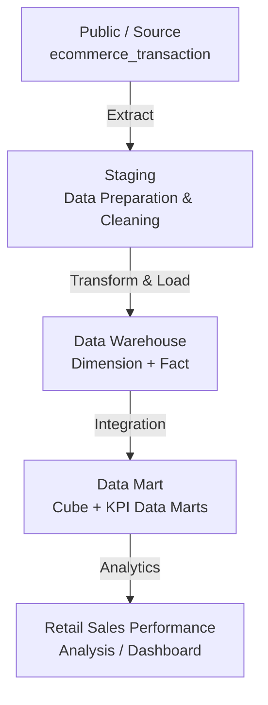
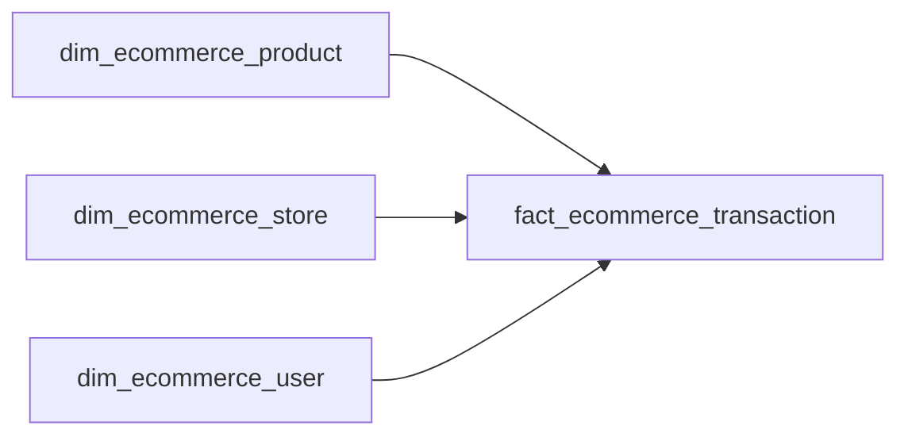

# E-Commerce Data Analytics: ETL Pipeline & Retail Sales Performance

## PostgreSQL ETL Pipeline

### ETL Overview

#### ETL

ETL (Extract, Transform, Load) is a data integration process used to extract data from source systems, transforms it into a consistent structure, and load it into a target system for analysis and reporting

#### Purpose

Building an ETL pipeline using PostgreSQL to transform raw e-commerce transaction data into structured, analytical-ready data for Retail Sales Performance Analysis 

#### ETL Scope

- Extract transaction data from the source table
- Load the data into the staging layer
- Perform data cleansing and transformation
- Create dimension and fact tables in the data warehouse
- Create a data mart cube and analytical data marts
- Automate the process using stored procedures 

#### ETL Architecture

The pipeline follows a layered architecture to transform raw e-commerce transaction data into analytical-ready data.



**Layers:**
- **Public**: source/raw transaction data
- **Staging**: initial data preparation and cleaning
- **Data Warehouse**: structured dimension and fact tables
- **Data Mart**: analytical cube and aggregated KPI tables
- **Retail Sales Analysis**: uses the processed data for business analysis and dashboarding

#### Analytical Purpose

The data processed through the pipeline is used as analytical-ready data to support retail sales performance analysis, including analysis of transactions, products, stores, quantities and revenue

#### Key Implementation

- PostgreSQL
- Staging layer
- Star schema
- Dimension & fact tables
- Data mart cube
- Range partitioning by transaction date
- Stored procedure for ETL automation
- Full refresh using TRUNCATE + INSERT

### Source Data

#### Source Table

```public.ecommerce_transaction``` is the raw transaction table that serves as the primary data source for the ETL pipeline.

#### Data Content
| Category    | Example Fields                                                  |
| ----------- | --------------------------------------------------------------- |
| Transaction | `id_transaksi`, `waktu_transaksi`, `transaksi_status`           |
| User        | `id_user`, `nama_user`, `gender_user`, `usia_user`, `kota_user` |
| Store       | `toko_id`, `toko_nama`, `toko_city`                             |
| Product     | `id_produk`, `produk_nama`, `produk_kategori`, `produk_harga`   |
| Sales       | `quantity`, `total_harga`                                       |
| Payment     | `payment_metode`                                                |
| Shipping    | `shipping_metode`                                               |

The source transaction table serves as the input to the ETL pipeline and is extracted into the staging layer for further processing.

### Staging & Data Transformation

The staging layer is used for initial data preparation and cleansing before the data is loaded into the data warehouse.

- Load extracted data into the staging table
- Add `last_update` as ETL metadata
- Handle missing values in `shipping_metode`
- Prepare the cleaned data for downstream processing

### Data Warehouse

The cleaned data from the staging layer is transformed into a structured data warehouse using a star schema. The data warehouse consists of dimension tables and a fact table.

#### Dimension Tables

- `datawarehouse.dim_ecommerce_product`
- `datawarehouse.dim_ecommerce_store`
- `datawarehouse.dim_ecommerce_user`

#### Fact Table

- `datawarehouse.fact_ecommerce_transaction`

Dimension tables store descriptive information about products, stores, and users, while the fact table stores e-commerce transaction records and measurable sales attributes such as quantity and total revenue.



### Data Mart Cube

The data mart cube integrates transaction data from the fact table with descriptive attributes from the product, store, and user dimension tables. The resulting dataset provides an analytical-ready structure for downstream aggregation and reporting.

#### Cube View
A data mart view is created by joining the fact transaction table with product, store, and user dimensions to provide a denormalized analytical view.

- Fact: `fact_ecommerce_transaction`
- Product: `dim_ecommerce_product`
- Store: `dim_ecommerce_store`
- User: `dim_ecommerce_user`

The resulting view is stored as:

`datamart.vw_dm_cube_ecommerce_transaction`

#### Physical Cube Table

The integrated data is loaded into the physical data mart cube:

`datamart.dm_cube_ecommerce_transaction`

The cube contains transaction, customer, product, store, quantity, revenue, payment, transaction status, and shipping information.

#### Data Deduplication

Duplicate transaction records are handled using `ROW_NUMBER()` partitioned by transaction ID, keeping the latest record based on `last_update`.

#### Refresh Strategy
 
The physical cube table uses a full-refresh approach by truncating existing data and reloading the latest integrated data from the cube view.

`TRUNCATE → INSERT`

This ensures that the cube contains the latest integrated data before downstream KPI data marts are refreshed.

### Partitioning

The cube table is partitioned by transaction date using range partitioning, with daily partitions to support time-based analytical queries.


### KPI Data Marts

### Stored Procedure & Automation

### ETL Validation

## Retail Sales Performance Analysis

### Background Business

Retail Crystal, during the January-March 2025 period, experienced high transaction volumes and dynamic changes in customer behaviors. The key performance indicator (KPI) used is total revenue, with a benchmark of maintaining a minimum average monthly revenue of 18.7T. However, revenue showed a downward trend during the analysis period, so it is necessary to monitor sales performance regularly to understand sales trends, best-selling products, regional contributions, and customer transaction patterns.

Therefore, a retail sales performance dashboard has been created to assist with sales analysis, monitor key KPIs, and support decision-making based on transaction data.

### Business Problem

The company is experiencing a downward trend in revenue and does not yet have a structured sales monitoring system in place to understand the factors affecting its business performance

### Problem Statement

- What were the sales trends during the January-March 2025 period?
- Which products made the largest contribution to revenue?
- Which category had the highest sales volume?
- Which region was the main contributor to revenue?
- When are customers most active in making purchase?

### Data Understanding

#### Dataset Overview

- Total records: 2000
- Fact table: Sales Transactions
- Dimension: Product, Store, User
- Analysis Period: January-March 2025

#### Feature Categories
- Product Information: Product Name, Category, Quantity, Total Price
- Store & Location Information: Province, City, Store Name
- Transaction Information: Order ID, Transaction Status, Payment Method, Shipping Method
- Time Information: Transaction Date, Transaction Time, Day Name, Month

#### Data Quality Issue
- Missing value shipping method

### Analytics


Insight:

- There was a 35% drop in revenue from January to March
- The number of transactions declined by only 17%
- February showed early signs of a decline in sales quality before demand fell in March


Insight:

- The Under Armour Gym Bag has become the product with the highest revenue contribution of 25.2 T
- Revenue is concentrated on a few key products, with an uneven contribution


Insight:

- Sports accounted for the highest proportion at 21.68%
- The distribution of quantities across categories is relatively even, with significant differences in their contributions


Insight:

- Medan is the city with the highest revenue contribution, amounting to 10.2T
- Semarang and Makassar have shown almost identical revenue performance despite being from different regions


Insight:

- Wednesday and Friday are the days with the highest number of orders
- The highest trading activity occurs during the midnight and morning periods

### Conclusion

- Revenue experienced a downward trend during the January-March 2025 period
- The decline in revenue was steeper than the decline in the number of transactions, which indicates a fall in AOV
- Specific products, cities and transaction times are the key contributors to sales performance
- The dashboard helps identify opportunities for optimizing campaigns based on products, regions, and customer transaction patterns

### Recommendation

- Increase AOV through bundling and cross-selling
- Focus promotions on high-revenue products
- Optimize inventory for high-volume categories
- Focus campaigns on the Top 5 cities
- Run promotions during peak transaction times
- Combine products, regions and transaction times to create data-driven campaigns, such as promotions for sports products in Medan on Friday evenings


